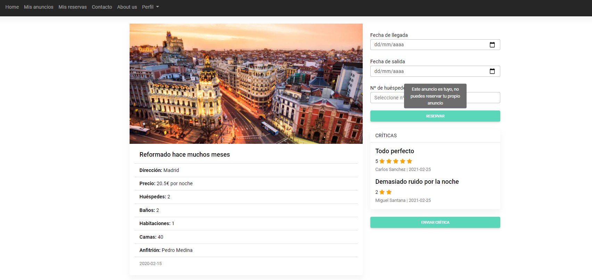

  
  
  <h3 align="center">Vacational Rental</h3>

  

    A simple application about Vacational Rental
     
    <a href=""><strong>Explore the docs »</strong></a>
     

<!-- TABLE OF CONTENTS -->

  
Table of Contents

  <ol>
    <li>
      <a href="#about-the-project">About The Project</a>
      <ul>
        <li><a href="#entity-relationship-diagram">Entity Relationship Diagram</a></li>
        <li><a href="#use-case-diagram">Use Case Diagram</a></li>
        <li><a href="#mockup">Mockup</a></li>
        <li><a href="#usability">Usability</a></li>
      </ul>
    </li>
    <li>
      <a href="#getting-started">Getting Started</a>
      <ul>
        <li><a href="#installation">Installation</a></li>
        <li><a href="#user-manual">User Manual</a></li>
      </ul>
    </li>
    <li><a href="#roadmap">Roadmap</a></li>
    <li><a href="#contributing">Contributing</a></li>
    <li><a href="#planning">Planning</a></li>
    <li><a href="#license">License</a></li>
    <li><a href="#prerequisites">Prerequisites</a></li>
    <li><a href="#built-with">Built with</a></li>
    <li><a href="#acknowledgements">Acknowledgements</a></li>
  </ol>

<!-- ABOUT THE PROJECT -->
## About The Project
A simple application in which users will be able to view advertisements for holiday rental. Registered users can book advertisements and publish reviews about them.

#### Entity-Relationship Diagram

    
  

  * **Entities**
    - User whose primary key is an ID, name, surname, DNI, contact phone, username and password.
    - Advert that has as primary key an identifying id, a basic description about the ad, the address of the ad, the price per night to rent it, the number of: rooms, guests allowed, beds and bathrooms.
    - Reviews that have as a primary key an identifying id, a description of the review and some stars as a numerical evaluation.

  * **Relatioships**
    - The publish relationship is about when a user publishes a certain advertisement on a certain date
    - The book relationship is about when a user books a certain ad by choosing a start date and an end date
    - The make relationship is about when a user makes a criticism about a certain ad on a certain date

#### Use case Diagram
  

    
  

#### User Requirements
* Platform
  - Responsive web

* Users will be able to search for ads to book by indicating the location where they want to stay, the dates they want and the number of guests that will be

* In order to make a book, the user must be registered

* Once you are registered and logged in, you can both book ads and create your own

*  Registered users will be able to leave a review of the ads they have booked

#### Mockup

*Screen 1:* First screen as soon as we enter the application in which we find a small form to be able to make searches of announcements

 

*Screen 2:* Menu to login where we will have to give our user name and password, if we do not have an account, we have the button to register

*Screen 3:* When you do a search, this would be the screen where the entire list of ads meeting the search criteria would be displayed

*Screen 4:* This is the window that shows the details of the ads. We can see all the attributes of the ads, such as the beds, guests, rooms, etc. We also see the reviews that this ad has and an average of them. There is also a button to book the ad if you wish.

*Screen 5:* In this window we can see the reservations associated to our user once we are logged in, it only allows us to cancel the booking.

*Screen 6:* In this window you can see your own advertisements created once the user is logged in, you have the option to edit or delete each of the advertisements. Then you have the option to create a new advertisement in the button below the advertisement list.

*Screen 7:* In this window you can see your own profile where you can edit o delete your account.

#### Usability
1. **The user must be able to customize the interface:** there is a toggle to select the theme we want between: light and dark

2. **Colour:** only two colours are used throughout the application interface, a light green and either black or white depending on the theme chosen

3. **Text writing in the interface:** there is little text in most of the application, especially when we have large lists, either of advertisements or books, we simply display the most necessary data to identify

4. **Legibility:** each piece of information given to the user is clearly identified, either within the advertisements specifying the numbers of guests, bathrooms, etc. or in the reservations, specifying the start and arrival dates

5. **Icons:** we can see the use of delete and update icons in the section of my bookings, as well as using the icon of a star to make clear the rating given to each of the ads

6. **Simplicity of the design:** the interface is simple, the information given at all times is the necessary one, the user is not overloaded with information

7. **Error recovery:** when you get the wrong credentials when logging in, you are informed

8. **Feedback:** when the user makes a search and the search does not meet any of the requirements he is informed that there are no results for his search

9. **Feedback:** when the user goes to review their reservations or announcements, they inform you when they do not have

10. **The user is indicated each time a value changes**, for example, you are trying to book your own advert or trying to book an advert when you're not logged

11. **The font**: is constant throughout the application always the same and using the bold and the size of the interface to highlight some information, especially in the lists of announcements, books, etc

#### Postman

Here we can find the Postman [documentation](https://documenter.getpostman.com/view/13041013/TWDcGEvM)

## Technology comparison

* NATIVE APPS

Native apps are those that use, during their development, the native language of the device on which they are to be installed.

In the case of iOS they are developed with Swift or Objective-C language.
For Android they are developed with Java.
According to Obux, among the advantages of native apps is: its excellent handling of sensors and services of mobile devices, its wide range to smartphones and the use of official tools for each platform.

* HYBRID APPS

Hybrid apps are developed using HTML5, CSS and JavaScript web technologies, which in turn will run in the system's native browser. These applications have a lower development cost than native ones, they can run on multiple devices and their distribution is more massive.

* WEBS APP

Finally, we find the app webs. They are accessed directly from the browser of the phone or tablet, and on almost all devices it will open almost the same way thanks to the use of Responsive Web Design. It is the simplest and most economical option, since it reduces development costs. Compatibility, usability and simplicity are among its advantages.

* PWAs

PWAs are commonly defined as Apps that bring together the best of web and native applications, even coming to be understood as a midpoint or an evolved form.
The base is web pages, but they use technologies that make their aesthetics and operation strongly resemble a native App, for example, by running in the background. They are accessed through a browser, but you can pin a shortcut on our device. 
They are progressive and responsive, because, it adapts to any device.
They do not need an internet connection. The visuals, the interaction and its style is the same as in native applications.Also, they are upgradeable and secure. In addition, they are easily found: you can do it through any web search engine; and they are linkable: you can share their URL, by WhatsApp, Messenger, etc.

<!-- GETTING STARTED -->
## Getting Started

### Installation

You can found [here](https://github.com/aaronmed/play-framework-vacations/wiki) the installation manual

### User manual

[Here](https://github.com/aaronmed/play-framework-vacations/blob/master/documentation/VacationsApp.pdf) you have the user manual to know how to navigate through the application:

<!-- ROADMAP -->
## Roadmap

See the [open issues](https://github.com/aaronmed/play-framework-vacations/issues) for a list of proposed features (and known issues).

<!-- CONTRIBUTING -->
## Contributing

Contributions are what make the open source community such an amazing place to be learn, inspire, and create. Any contributions you make are **greatly appreciated**.

1. Fork the Project
2. Create your Feature Branch (`git checkout -b feature/AmazingFeature`)
3. Commit your Changes (`git commit -m 'Add some AmazingFeature'`)
4. Push to the Branch (`git push origin feature/AmazingFeature`)
5. Open a Pull Request

## Planning
The planning that has been carried out for this project has been done on GitHub. Within the repository where we have uploaded the project, there is a function that allows you to organize the tasks you want to perform. To have planned these tasks, it is necessary to create them first, therefore, this creation is done in the issues section. After you create all the tasks, in the Projects section, a project is created that allows you to plan those tasks. And there are several planning options, in my case I used the authomatic-kanvas. This option allows you to organize tasks into three parts: to do, in progress, and done. Finally, you are putting the tasks according to how you have done them.

Here can see my [planning](https://github.com/aaronmed/play-framework-vacations/projects/1) 

<!-- LICENSE -->
## License

Distributed under the MIT License. See `LICENSE` for more information.

## Prerequisites

* [Git](https://git-scm.com/)
* [MySQL](https://www.mysql.com/)
* [Java8](https://www.java.com/es/)

## Built With

* [Postman](https://www.postman.com/)

    Postman is a popular API client that makes it easy for developers to create, share, test and document APIs. This is done by allowing users to create and save simple and complex HTTP/s requests, as well as read their responses. The result - more efficient and less tedious work.
* [MySql](https://www.mysql.com)

    MySql is an application framework and inversion of control container for the Java platform. The framework's core features can be used by any Java application, but there are extensions for building web applications on top of the Java EE (Enterprise Edition) platform. Although the framework does not impose any specific programming model, it has become popular in the Java community as an addition to the Enterprise JavaBeans (EJB) model. 

* [Play-Framework](https://www.playframework.com/) Versión 1.4.5

  Play is a high-productivity Java and Scala web application framework that integrates components and APIs for modern web application development. Play was developed by web developers for web application development.

  You will find Play’s Model-View-Controller (MVC) architecture familiar and easy to learn. Play provides concise and functional programming patterns

## Acknowledgements
* [Cristian Eliel Bruna Mendez](https://github.com/elbrus19)

